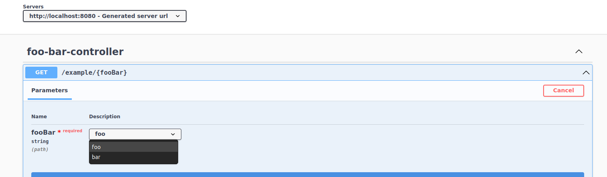
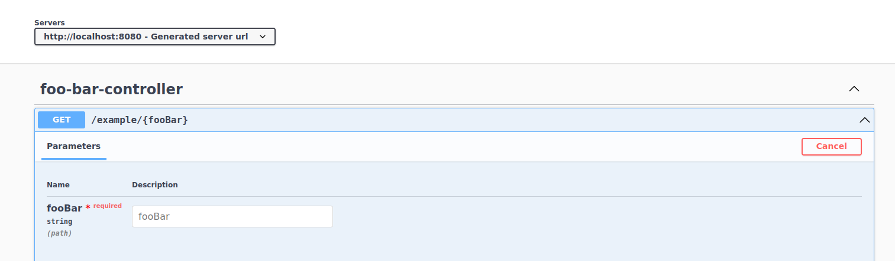

# Example project for springdoc enum bug after upgrade from 1.6.6

Change springdoc version in build.gradle.kts to test this.

##### Build with 

```
./gradlew clean build
```

##### and then run with

```
java -jar build/libs/enum-problem-example-0.0.1-SNAPSHOT.jar
```

### In 1.6.6 there is drop-down (so enum from @schema-annotation is generated correctly)

```
[{"name":"fooBar","in":"path","required":true,"schema":{"type":"string","enum":["foo","bar"]}}]
```



### In 1.6.7 and 1.6.13 there isn't drop-down (so enum from @schema-annotation isn't generated as expected)

```
[{"name":"fooBar","in":"path","required":true,"schema":{"type":"string"}}]
```


